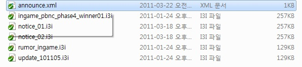
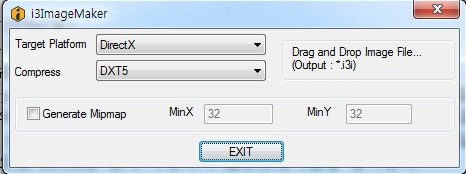
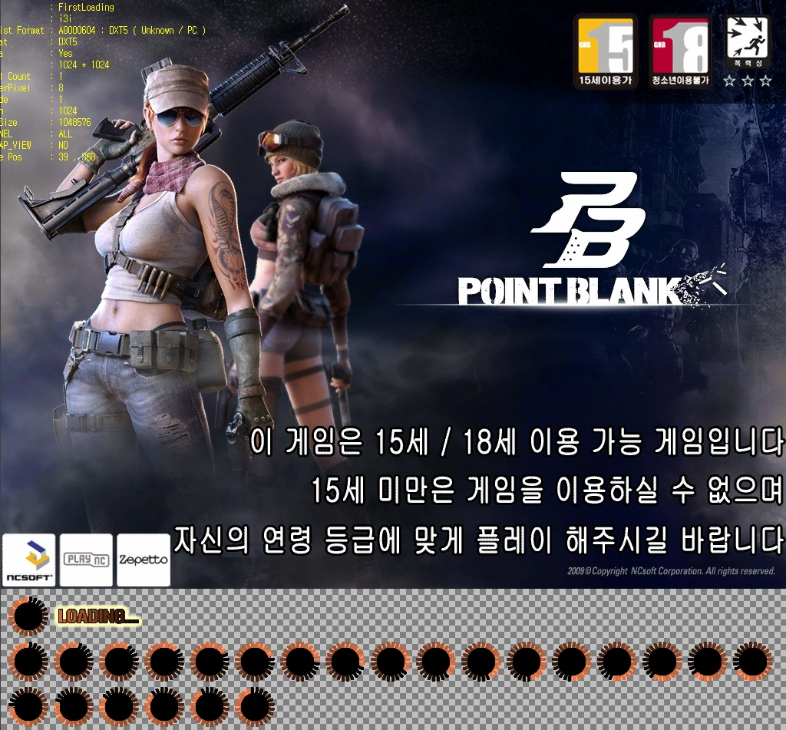
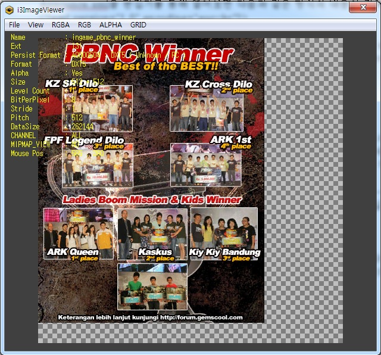

This document explains how to change Point Blank’s announcements and loading images. 

* Sequence
* * Change Announcement
* * Change the Loading Image
* * Change Announcement 



If you look at the “gameexecutionfolder\Gui\Image” in the game folder, you’ll see the 
announce.xml and the i3i image files in the filename exe.

announce.xml file indicates the file name with the announcement images that will be loaded and the filename exe i3i has the in game announcement images.

If you open Announce.xml via the gameeditor, you’ll see the below text.


```xml
<?xml version="1.0" encoding="euc-kr"?>
<ANNOUNCE>
<IMAGE name="Notice1" path="Gui/Image/ingame_pbnc_winner.i3i" scroll="0"/>
<IMAGE name="Notice2" path="Gui/Image/christmas_ingame.i3i" scroll="0"/>
<!-- (Max 5 Lines = The max announcement images are 5) -->
</ANNOUNCE>
```

The sentences that determine the announcement images are texts in this format
<IMAGE name="" path="" scroll=""/>
Three proprieties exist - name, path, scroll, and among them depending on the number of the notices, the “name” can be determined as Notice1, Notice2, etc.  

It can be determined as Notice + Number.  

“Path” is the file name for the announcement image, so you can input the same text as the announcement file within the folder.  

Lastly, “scroll” is currently not in use, so you can input 0.

***

If another image is extended to create the announcement image, it must be converted into i3i exe file.  You can convert the image with the i3ImageMaker (in the i3ImageMaker file, delete the exe name and run it) and drop/create converted files in the i3ImageMaker.



When you convert the file, have the Target Flatform set up to DirectX. Compress should be DXT5, and don't check box on Generate Mipmap.  The file format that can be applied in I3ImageMaker is **Photoshop.tgs file** and the alpha value is used.

The image size is 512 * 512 and the **range the alpha value is applied is 380*478**.  (Refer to Example Image #1) The announcement image must be set as **380*478**.  After the file format is converted, once the name and path are filled in, then the announcement is complete.

* Change the Loading Image

If you take a look at \Gui\Loading” in the game folder, there’s a file called FirstLoading.i3i.



Similar to creating the announcement image using the I3Imagemaker, you can create the loading image, but the **tga file loading image size is 1024*1024 and the actual image size is 1024*768.** 
For the remaining boundaries, the necessary animation prime shots are inserted.

