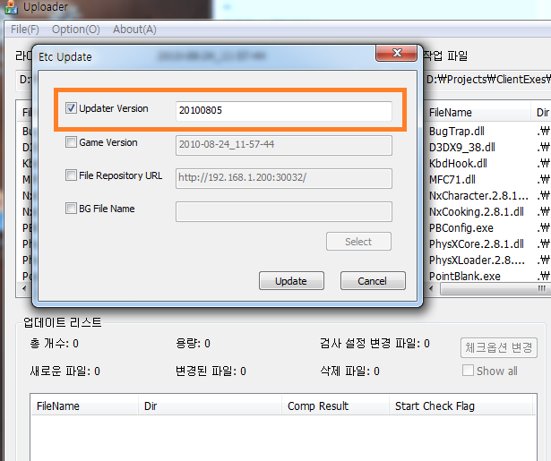
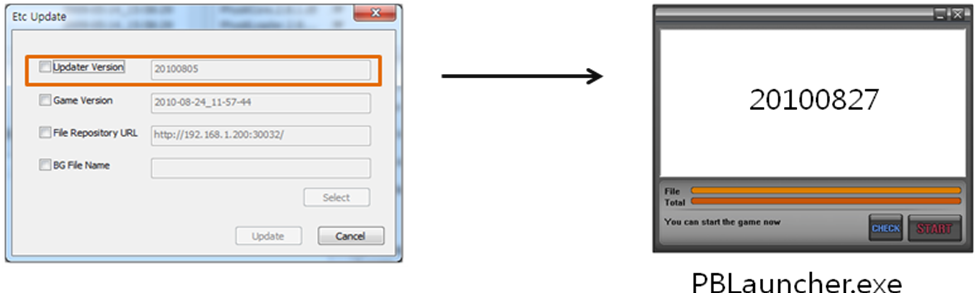
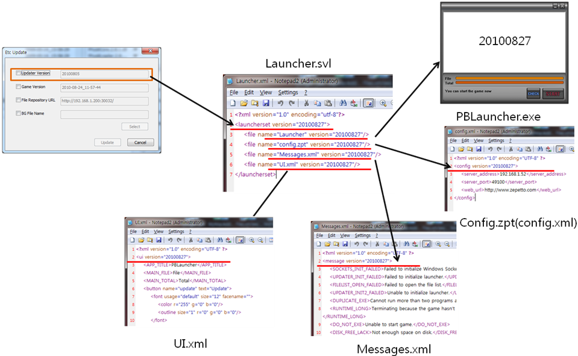
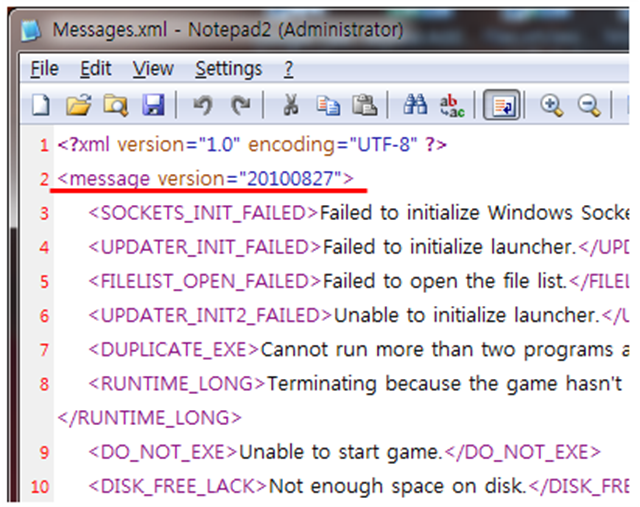
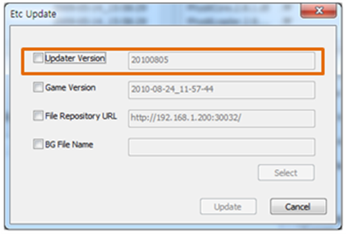
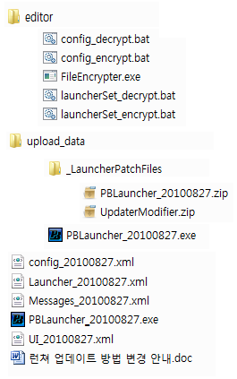

새로 릴리즈된 런쳐 변경사항에 대해서 알려드립니다.

변경된 내용은 아래와 같습니다.

1. Messages.xml, UI.xml, config.zpt 파일 업데이트 기능이 추가되었습니다.
2. 런쳐파일들인 PBLauncher.exe, Messages.xml, UI.xml, config.zpt 4개 파일의 버전 정보가 저장되어 있는 Launcher.svl 파일이 추가되었습니다.
3. 런쳐 업데이트 방법이 변경되었습니다.

기존에는 config.zpt, Messages.xml, UI.xml 가 한번 배포하고 업데이트를 할 수 없는 문제점이 있었습니다. 그래서 임시방편으로 패치파일로 포함하여 업데이트를 하도록 하였습니다.

이 방법은 잊어주시고 아래 안내해 드리는 방법으로 업데이트를 해주시기 바랍니다.

아래 설명에서는 다음 항목을 설명합니다.
1. **새로운 런쳐 업데이트 방법**
2. **전달파일 설명**
3. **기존 런쳐에서 새로운 런쳐로 업데이트 하는 방법**

반드시 모두 숙지하여 진행하여 주시기 바랍니다.

실제 서비스에 적용 전 테스트도 진행하여 주십시오.

# 1. 새로운 런쳐 업데이트 방법
새로운 업데이트 방법을 설명하기 전에 기존방법과 버전의 의미에 대해서 다시 설명하고 어떻게 변경되었는지 설명하겠습니다.

기존에는 런쳐실행파일(PBLauncher.exe)만 단독으로 업데이트 할 수 있었습니다.

1. 파일서버에는 새로운 버전의 런쳐를 PBLauncher_********.exe 와 같이 올려 두고
2. 아래의 그림과 같이 업로더를 실행한 후 메뉴 -> Etc Update 를 선택하여
3. 다이얼로그에서 Updater Version 항목을 새로운 런쳐 버전으로 입력한 후 업데이트를 하여 런쳐를 업데이트 했습니다.

기존에는 아래 그림과 같이 Updater Version이 런쳐버전과 1:1로 대응하였습니다.

**새로 릴리즈되는 런쳐부터는 업로더에서 지정하는 Updater Version과 런쳐버전이 대응하지 않습니다.**

**그 대신 Updater Version과 Launcher.svl 파일의 버전과 1:1로 대응합니다.**

그림으로 Updater Version과 Launcher.svl, 그리고 런쳐파일들의 관계를 나타내면 아래와 같습니다.

위 그림을 확대하여서 보시면 각 파일에는 버전이 있으며 Launcher.svl 파일에는 런쳐와 런쳐 설정파일들의 버전이 저장되어 있습니다.

이 정보를 토대로 런쳐는 실행시 업데이터서버에서 전달해주는 버전과 Launcher.svl의 버전을 비교하여서 다를 경우 새로운 Launcher.svl 버전 파일을 받게되고 새로운 Launcher.svl에서 설정파일의 버전이 변경되었는지 확인하여 업데이트가 필요한 설정파일을 새로 내려받게 됩니다.

업데이트는 아래와 같은 방법으로 이루어집니다.

UI.xml, Messages.xml, config.zpt 파일의 업데이트 방법은 모두 동일하며 PBLauncher.exe만 업데이트 하는 방법이 약간 다릅니다.

예시로 Messages.xml 을 업데이트 하는 방법을 설명하겠습니다.

1. Messages.xml파일을 수정합니다 (오타 또는 문구가 추가 될 경우 입니다.)
2. Messages.xml의 버전을 변경합니다. **버전은 반드시 양의 정수로 해주십시오** 아래 그림과 같이 version=”” 항목의 버전을 수정하면 됩니다.

3. Launcher.xml 파일을 열어서 launcherset 의 버전과 Messages.xml파일의 버전을 수정합니다. 아래 그림에서 밑줄 친 부분 각각의 version=”” 을 수정하면 됩니다. launcherset의 version은 Launcher.xml 파일의 버전을 나타냅니다.

4. Launcher.xml 파일을 암호화 합니다. (암호화 방법은 아래에서 설명합니다.)
* * 암호화하면 Launcher.svl이라는 파일이 만들어 집니다. 이 파일이 암호화 된 파일입니다.

5. Launcher.svl과 Messages.xml 파일의 이름을 각각의 버전을 포함한 이름으로 변경합니다
* * Launcher.svl -> Launcher_20100827.svl
* * Messages.xml -> Messages_20100827.xml
* * 20100827은 버전의 예시입니다. 두개의 버전을 다를 수 있습니다.
* * 위와 같이 변경합니다.

6. 2 파일을 각각 zip으로 압축합니다.
* * 압축 한 후 파일이름은 확장자만 zip이어야 합니다.
* * Launcher_20100827.zip
* * Messages_20100827.zip

7. 파일서버에 _LauncherPatchFiles 폴더에 복사합니다. (파일서버는 게임패치가 저장되는 곳 입니다.)
8. 업로더를 실행하여 메뉴 -> ETC Update를 눌러서 아래와 같은 다이얼로그 박스가 뜨면 Updater Version을 수정하여 “Update” 버튼을 눌러서 변경합니다.

# 2. 전달파일 설명
새로운 런쳐와 런쳐설정파일 모두 새로 전달드립니다.

파일은 아래와 같이 있습니다.

**editor 폴더**

이 폴더 파일들은 기존 configEncrypter와 configDecrypter를 대체합니다.

configEncrypter와 configDecrypter는 config.xml만 수정하는 실행파일이었지만 Launcher.svl도 암호화된 파일이기 때문에 새로 전달드립니다.

1. config_decrypter.bat : config.xml 파일을 config.zpt 파일로 암호화 합니다.
2. config_encrpyter.bat : config.zpt 파일을 config.xml로 복호화 합니다.
3. launcherSet_decrypt.bat : Launcher.xml 파일을 Launcher.svl 파일로 암호화 합니다.
4. launcherSet_encrypt.bat : Launcher.svl 파일을 Launcher.xml 파일로 암호화 합니다.
5. FileEncrypter : 위 4개의 bat파일의 명령을 수행하는 프로그램입니다.

위 암호화/복호화 하는 파일은 암호화/복호화 할 대상파일과 같은 폴더에 존재해야 하며 파일이름의 위 설명과 같아야합니다.

만약 config_20100827.xml 파일을 암호화 할 경우에는 config.xml로 파일이름을 변경한 후 암호화 하시기 바랍니다.

**upload_data 폴더**

이 폴더의 파일들은 파일서버에 복사할 파일들입니다. 새로운 런쳐는 업데이트 받는 곳이 변경되었기 때문에 새로운 구조로 파일들을 배치하였습니다.

아래 **3. 기존런쳐에서 새로운 런쳐로 업데이트 하는 방법** 을 참고하시고 사용하시기 바랍니다.

Root 폴더 파일.

config_20100827.xml

Launcher_20100827.xml

Messages_20100827.xml

PBLauncher_20100827.exe

UI_20100827.xml

위 파일들은 새로 릴리즈된 런쳐 파일들입니다.

**PBLauncher_20100827.exe를 제외한 나머지 4개 파일들은 반드시 검토하시어 올바른 값을 갖게 해주십시오.**

3. 기존 런쳐에서 새로운 런쳐로 업데이트 하는 방법
런쳐 업데이트 할 때 게임패치도 같이 이뤄져야 합니다. 이전에 Messages.xml, UI.xml를 패치파일에 포함하여 임시로 업데이트 한 것을 패치파일리스트에서 제거해야 하기 때문입니다. Messages.xml, UI.xml를 제거하는 패치를 만들어서 같이 진행 해주십시오.

만약 config.zpt 파일도 포함되어 있다면 같이 제거하여 주십시오.

위 2번에 설명된 파일중에서 upload_data폴더에 있는 파일을 파일서버 루트폴더에 복사하십시오.

(파일서버 루트폴더 게임패치파일이 저장되는 곳을 말합니다.)

**Upload_data 폴더도 같이 복사하지 마시고 upload_data 폴더안에 들어있는 파일과 폴더들만 그대로 복사하시기 바랍니다.**

**새로운 런쳐부터는 파일서버/_LauncherPatchFiles로 찾기 때문입니다.**

올바른 값으로 수정한 런쳐 설정파일인 config_20100827.xml, Launcher_20100827.xml, Messages_20100827.xml, UI_20100827.xml를 수정하였으면 각각 아래와 같이 압축하여 주십시오.

config_20100827.xml -> config_20100827.zip

Launcher_20100827.xml -> Launcher_20100827.zip

Messages_20100827.xml -> Messages_20100827.zip

UI_20100827.xml -> UI_20100827.zip

압축을 한 후 _LauncherPatchFiles 폴더에 복사하십시오.

최종적으로 _LauncherPatchFiles 폴더에는 아래와 같이 파일이 있어야합니다.

파일 복사가 완료되었다면 업로더를 이용하여 Updater Version을 20100827 으로 업데이트 하시기 바랍니다.
